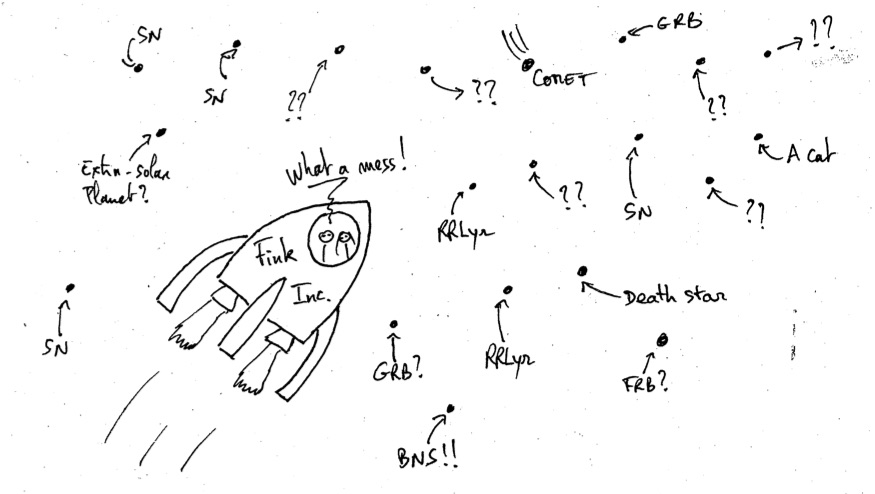
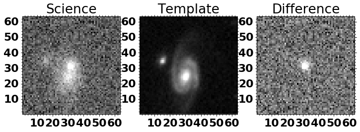
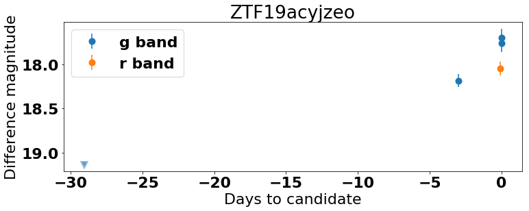
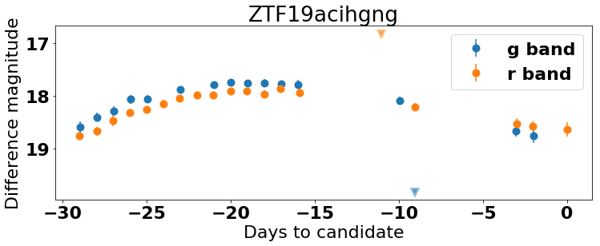
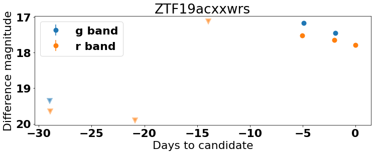
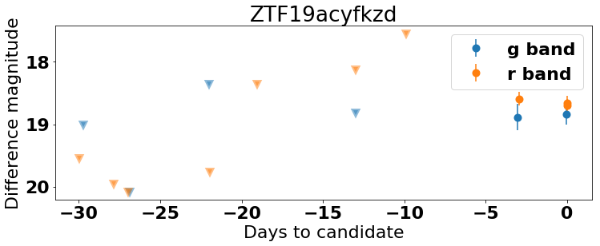

# Exploring ZTF Alerts

This first tutorial shows how to open, explore and display information contained in an alert from ZTF. You can play this tutorial in a Jupyter notebook, an interactive Python session, or a Python script.



**Before starting**

Make sure `fink-client` is correctly installed (see the [index](../index.html) page of the tutorial).

## Set up

Import necessary packages and set up matplotlib parameters for readable plots

```python
import matplotlib.pyplot as plt
import matplotlib

import numpy as np

from fink_client.avroUtils import AlertReader
from fink_client.visualisation import show_stamps
from fink_client.visualisation import extract_field

# For plots
font = {
    'weight': 'bold',
    'size': 22
}

matplotlib.rc('font', **font)

# Bands
filter_color = {1: '#1f77b4', 2: '#ff7f0e', 3: '#2ca02c'}
# [
#     '#1f77b4',  # muted blue
#     '#ff7f0e',  # safety orange
#     '#2ca02c',  # cooked asparagus green
#     '#d62728',  # brick red
#     '#9467bd',  # muted purple
#     '#8c564b',  # chestnut brown
#     '#e377c2',  # raspberry yogurt pink
#     '#7f7f7f',  # middle gray
#     '#bcbd22',  # curry yellow-green
#     '#17becf'   # blue-teal
# ]
filter_name = {1: 'g band', 2: 'r band', 3: 'i band'}
```

## Load alert data

ZTF alert data are serialised in Avro format. Since this format is not widely spread in the astronomy community, we provide the class `AlertReader` to ease the alert manipulation. You can pass to it a single alert file, or a folder containing alerts:


```python
# you will find datatest/ in the tutorial repo.
r = AlertReader('datatest')
```

The reader has methods to load data, and you will probably find useful the `to_pandas` method that loads alert data into a Pandas DataFrame:


```python
# Store alert data in a Pandas DataFrame
df = r.to_pandas()
```

Similarly, you have a method `to_list`, that loads the data into a list of dictionaries (each alert being a dictionary), or `to_iterator` that returns a generator.

**Exercise:** Explore the content of alerts. What information is available? You will find the description of each field at https://zwickytransientfacility.github.io/ztf-avro-alert/

## Display cutouts

You might have noticed the fields `cutout*` in each alert. These fields are 60x60 pixels image around the position of the alert. You have 3 such fields:
- `cutoutScience`: the observation made by ZTF
- `cutoutTemplate`: the reference image used to make the comparison with the observation
- `cutoutDifference`: The difference between the observation and the reference image.

These cutouts are stored in binary (gzip-compressed FITS cutout image). We expose the function `show_stamps` to ease their visualisation.

```python
# Take the first alert
alert = r.to_list(size=1)[0]

# Display the cutouts contained in the alert
print(alert['objectId'])
fig = plt.figure(num=0, figsize=(12, 4))
show_stamps(alert, fig)
```



## Display lightcurve data

Each alert has the information about the current observation (field `candidate`), but it also contains historical information at the same location up to one month (field `prv_candidates`). Fink exposes routine to retrieve the full information as one vector:

```python
# Extract all measurement dates contained in the alert
all_dates = extract_field(alert, 'jd')
```

This allows us to reconstruct the lightcurve for example. Note that we use the magnitude from PSF-fit photometry here (we could also have derived the apparent magnitude from the different fields)

```python
# Load alert data
alerts = r.to_list()

# and plot the difference magnitude as function of time.
# Measurements and upper limits are treated separately.
for alert in alerts:
    # extract current and historical data as one vector
    mag = extract_field(alert, 'magpsf')
    error = extract_field(alert, 'sigmapsf')
    upper = extract_field(alert, "diffmaglim")

    # filter bands
    fid = extract_field(alert, "fid")

    # Rescale dates to end at 0
    jd = extract_field(alert, "jd")
    dates = np.array([i - jd[0] for i in jd])

    # Title of the plot (alert ID)
    title = alert["objectId"]

    # loop over filters
    fig = plt.figure(num=1, figsize=(12, 4))

    # Loop over each filter
    for filt in filter_color.keys():
        mask = np.where(fid == filt)[0]

        # Skip if no data
        if len(mask) == 0:
            continue

        # y data
        maskNotNone = mag[mask] != None
        plt.errorbar(
            dates[mask][maskNotNone], mag[mask][maskNotNone],
            yerr=error[mask][maskNotNone],
            color=filter_color[filt], marker='o',
            ls='', label=filter_name[filt], mew=4)
        # Upper limits
        plt.plot(
            dates[mask][~maskNotNone], upper[mask][~maskNotNone],
            color=filter_color[filt], marker='v', ls='', mew=4, alpha=0.5)
        plt.title(title)
    plt.legend()
    plt.gca().invert_yaxis()
    plt.xlabel('Days to candidate')
    plt.ylabel('Difference magnitude')
    plt.show()
```













You could also plot data directly from pandas DataFrame, using built-in pandas tools.

## Visualising alerts with CLI

`fink-client` exposes also the program `fink_alert_viewer` to visualise alerts from the terminal directly:

```bash
fink_alert_viewer -h
usage: fink_alert_viewer [-h] [-filename FILENAME]

Display cutouts and lightcurve from a ZTF alert

optional arguments:
  -h, --help          show this help message and exit
  -filename FILENAME  Path to an alert data file (avro format)
```

Make sure that `$FINK_CLIENT_HOME/bin` is in your `$PATH` (see the beginning of this tutorial). Go to a folder with alerts (e.g. `dataset/` in the tutorial repository), and call it on one file:

```bash
fink_alert_viewer -filename ZTF19acihgng.avro
# display cutouts & lightcurve
```
