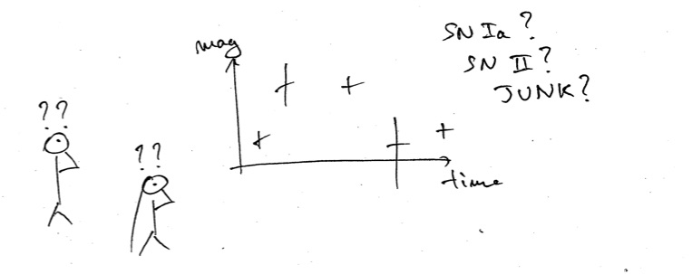

# Fink science modules & broker added values

Each night, telescopes are sending raw alerts, with minimal information such as sky location, flux of the transient, and historical data at this location. The main role of brokers is to enrich these alerts by adding new information to identify interesting candidates for follow-up observations or further scientific processing.

## Fink science cases

In Fink we mainly focus on 4 science cases, namely we have experts onboard on:

* Detection of supernovae: Ia, but not only!
* Multi-messenger astronomy: Gamma Ray Bursts, gamma ray, X, gravitational waves, neutrino, ...
* Study of micro-lensing: compact objects, ...
* Anomaly detection: unravelling the unknown!

For each of these cases, the enrichment is provided by the broker services (e.g. identification from the CDS cross-match service) and by collaborator science modules (e.g. classification based on machine learning, annotation, or feature extraction algorithms). The added information is in form of extra fields inside the redistributed alert packet, and you would access to it the same way as any other LSST or ZTF original fields. Below we summarise the fields currently added by the Fink science modules:

| Field | Type | Contents |
|:--------|:-------|:--------|
| `cdsxmatch` | string | Counterpart (cross-match) in the Simbad database |
| `rfscore` | float | Probability to be a SN Ia based on Random Forest classifier (1 is SN Ia). Based on https://arxiv.org/abs/1804.03765 |

## How to include your science case in Fink?

First let [us](mailto:peloton@lal.in2p3.fr,emilleishida@gmail.com,anais.moller@clermont.in2p3.fr) know about your science proposal! We are open to contributions in the science cases mentioned above, but also to new contributions that are not listed.

Note however that the integration inside the broker is not trivial, as one needs to take into account for example the streaming aspect of the processing and the distributed environment aspect (software and data are distributed and alerts are processed on many machines). In any case, if you already have a scientific module or prototype, we would be super happy to make the integration within the broker, otherwise we will design it together. Keep in mind, the criteria for acceptance are:

* The science module works ;-)
* The execution time is not too long.

We want to process data as fast as possible, and long running times add delay for further follow-up observations. What execution time is acceptable? It depends, but in any case communicate early the extra time overhead, and we can have a look together on how to speed-up the process if needed.
